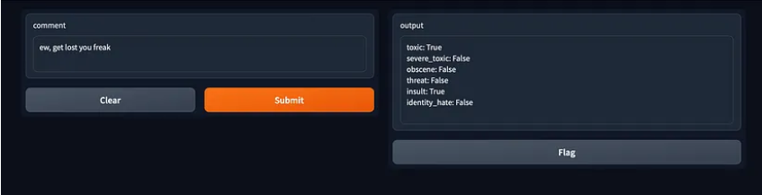

# Comment-Toxicity-using-BiLSTM
Built an end-to-end pipeline to be able to classify the degree of toxicity of user comments using BiLSTM-based Deep Learning model and finally built a Gradio-based UI to enable users to deploy the model locally for inferencing.

Run the Comment_Toxicity_using_BiLSTM file first which will create and save the trained model object. Then run the Gradio notebook which will use the trained model to enable the interface for users to make real-time predictions 

